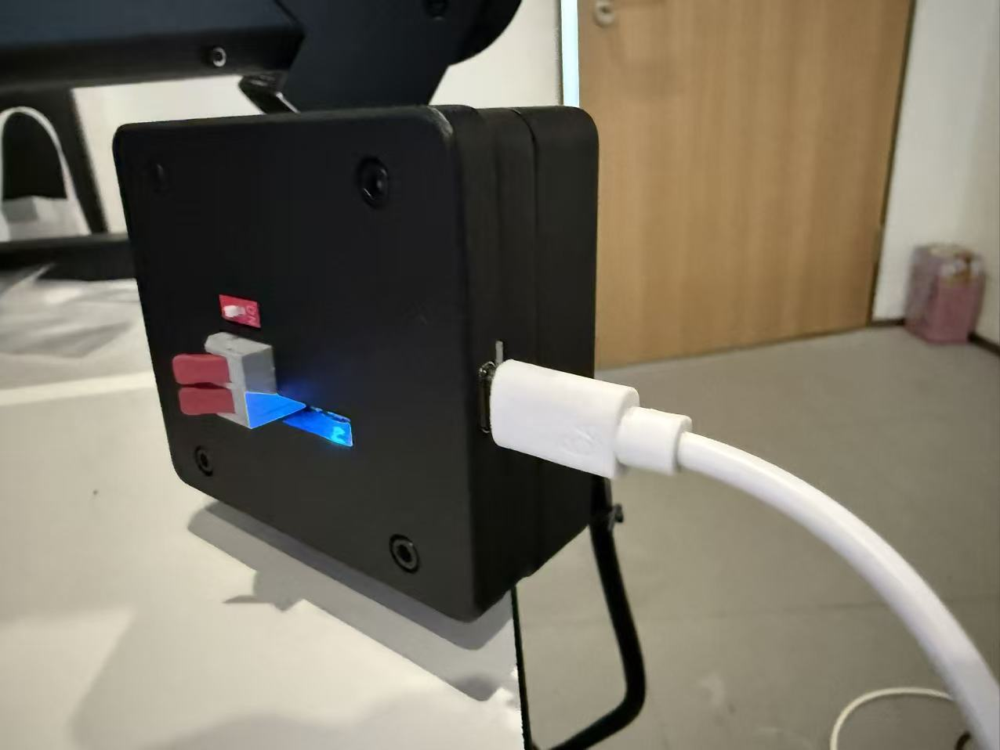

# ARX X5 Project Overview & Implementation Notes

> Target: ARX X5 single arm (AC one, left arm), ROS2 Jazzy (Ubuntu 24.04)  
> Last updated: 2026-01-29

---

## 1. Overview

This repository records the bring-up process and subsequent feature implementations for the ARX X5 robotic arm (startup, keyboard teleop, teach/replay, simulation training).  
Core goal: **get the official SDK / ROS2 driver running reliably, then build safe and reusable high-level control and data collection on top of it.**

Official upstream repo:

- `https://github.com/ARXroboticsX/ARX_X5`

References:

- `https://github.com/real-stanford/arx5-sdk`
- `https://github.com/ARISE-Initiative/robomimic`

---

## 2. Hardware Specs (Reference Only)

> Parameters below are collected from public videos/papers/reproduction notes. Minor differences may exist. For rough scale only.

  
*ARX X5 arm photo*

- DoF: 6
- Mass: ~3.3 kg (with gripper)
- Reach: ~620 mm (ARX5), ARX5a ~510 mm
- Payload: ~1.5–2 kg (varies across sources)

---

## 3. Repository Layout (Official)

- `ROS/X5_ws`: ROS1 workspace
- `ROS2/X5_ws/src`: ROS2 workspace source
- `ARX_CAN`: CAN bus communication code
- `arx_joy/src/arx_joy`: gamepad teleop ROS package
- `py/arx_x5_python`: Python interface
- `ARX_VR_SDK`: VR control SDK
- `00-readme` / `00-sh`: install & launch scripts

> Current setup uses the single-arm version (AC one). VR / gamepad control is not available.

---

## 4. Bring-up (ROS2 Jazzy)

### 4.1 Environment

  
*Ubuntu 24.04 + ROS2 Jazzy environment*

- OS: Ubuntu 24.04 (Desktop recommended)
- ROS2: Jazzy
- Arm model: AC one
- Launch scripts: marked with `v2`

> Apple Silicon VMs cannot run the official scripts properly, so Ubuntu 24.04 was installed on an x86_64 machine (dual-boot).

---

### 4.2 CAN Device Binding

  
*CAN USB connection diagram*

Steps:

1. Run `search.sh` to find the serial
2. Modify `arx_can.rules`
3. Run `set.sh` to apply rules
4. Start the corresponding `arx_can*.sh`

Notes:

- Only **one** CAN-USB adapter can be plugged in at a time (bind them one-by-one)
- AC one left arm uses `can1`

---

### 4.3 Start CAN

```bash
./arx_can1.sh
```

Proceed only after CAN1 looks normal.

### 4.4 Start ROS2 Controller Node

```bash
cd ARX_X5/ROS2/X5_ws
source install/setup.bash

# X5-2023
ros2 launch arx_x5_controller open_single_arm.launch.py
```

Only one control terminal should run at a time. Multiple controllers can cause jitter or control contention.

### 4.5 rqt Test

  
*Joint control test via rqt*

```bash
cd ARX_X5/ROS2/X5_ws
source install/setup.bash
rqt
```

For link validation, keep joint changes within ±0.1 rad (except the gripper).

### 4.6 Read Feedback

```bash
source install/setup.bash
ros2 topic echo /arm_status
```

Field meanings:

- `end_pos`: end-effector position / pose
- `joint_pos`: 6 joint angles
- `gripper`: gripper open/close state

---

## 5. Keyboard Control (Joint Space)

### 5.1 Concept

Continuously subscribe to `/arm_status` to get current joint angles → apply small increments on key press → publish to `/arm_cmd`.

### 5.2 Create ROS2 Package

```bash
cd ~/Downloads/ARX_X5-main/ROS2/X5_ws
source install/setup.bash
cd src
ros2 pkg create --build-type ament_python arx_keyboard_teleop
```

### 5.3 Main Program

File:

```
ROS2/X5_ws/src/arx_keyboard_teleop/arx_keyboard_teleop/teleop_joint.py
```

### 5.4 Register Entry Point

Edit `setup.py`:

```python
entry_points={
    'console_scripts': [
        'teleop_joint = arx_keyboard_teleop.teleop_joint:main',
    ],
},
```

### 5.5 Build & Run

```bash
cd ~/Downloads/ARX_X5-main/ROS2/X5_ws
colcon build --packages-select arx_keyboard_teleop
source install/setup.bash
ros2 run arx_keyboard_teleop teleop_joint
```

### 5.6 Safety Mechanisms (Strongly Recommended)

  
*Joint-space keyboard teleop demo*

- **Deadman key**: no motion unless held; release to stop immediately (recommended Shift or Space)
- **Velocity / acceleration limits**: prevent jitter and impact
  - Joint speed limit: 5°/s (~0.087 rad/s)
  - Acceleration limit: 20°/s² (~0.35 rad/s²)
- **Publish rate**: 50 Hz
- **Watchdog**: no key updates within 0.2s → auto stop
- **Soft limits + posture interlock**: certain joints only allowed if others are in safe ranges

Example interlock logic:

```python
allow_move(joint_id, q):
    if joint_id in {J5, J6}:
        return (q3 in safe_range3) and (q4 in safe_range4)
    return True
```

---

## 6. Keyboard Control (Cartesian Space)

### 6.1 Concept

Subscribe to `/arm_status` and use `end_pos` as the starting point. Keys output end-effector velocity; integrate to a target pose; publish `/arm_cmd` with mode=4.

### 6.2 Create ROS2 Package

```bash
cd ~/Downloads/ARX_X5-main/ROS2/X5_ws
source install/setup.bash
cd src
ros2 pkg create --build-type ament_python arx_keyboard_cart_teleop
```

### 6.3 Main Program

```
ROS2/X5_ws/src/arx_keyboard_cart_teleop/arx_keyboard_cart_teleop/teleop_cart.py
```

### 6.4 Register Entry Point

```python
entry_points={
    'console_scripts': [
        'teleop_cart = arx_keyboard_cart_teleop.teleop_cart:main',
    ],
},
```

### 6.5 Build & Run

```bash
cd ~/Downloads/ARX_X5-main/ROS2/X5_ws
colcon build --packages-select arx_keyboard_cart_teleop
source install/setup.bash

# Start controller first, then run teleop
ros2 run arx_keyboard_cart_teleop teleop_cart
```

### 6.6 Key Mapping (Example)

  
*Cartesian-space keyboard teleop demo*

- **Deadman**: Shift (hold to move)
- **Translation**:
  - W/S: +X / -X
  - A/D: +Y / -Y
  - R/F: +Z / -Z
- **Rotation** (Roll/Pitch/Yaw):
  - I/K: +Roll / -Roll
  - J/L: +Pitch / -Pitch
  - U/O: +Yaw / -Yaw
- **Speed adjustment**:
  - Z/X: decrease/increase translation speed
  - C/V: decrease/increase rotation speed
- **Emergency stop**: ESC

---

## 7. Joint Limits (Reference)

Use official limits as the source of truth.

- J1: [-1.57, 1.57]
- J2: [-0.1, 3.6 ]
- J3: [-0.1, 3.0 ]
- J4: [-1.29, 1.29]
- J5: [-1.48, 1.48]
- J6: [-1.74, 1.74]
- J7 (gripper): [-3.4, 0.1]

---

## 8. Teach / Replay (SDK)

Reference: https://github.com/real-stanford/arx5-sdk

### 8.1 Install Miniforge (x86_64)

```bash
uname -m
cd ~
curl -L -o Miniforge3.sh https://github.com/conda-forge/miniforge/releases/latest/download/Miniforge3-Linux-x86_64.sh
bash Miniforge3.sh -b -p "$HOME/miniforge3"
echo 'export PATH="$HOME/miniforge3/bin:$PATH"' >> ~/.bashrc
source ~/.bashrc
```

### 8.2 Create Env & Build SDK

```bash
cd ~/arx5-sdk
mamba env create -f conda_environments/py310_environment.yaml
conda activate arx-py310

mkdir -p build && cd build
cmake ..
make -j
```

### 8.3 Test

```bash
cd ~/arx5-sdk/python
conda activate arx-py310
python examples/test_joint_control.py X5 can1
```

### 8.4 Teach / Replay

  
*Teach & Replay workflow diagram*

```bash
python examples/teach_replay.py -h
```

### 8.5 Custom Version (teach_replay_new.py)

  
*Data collection via Teach/Replay*

Goals:

- Allow setting a new "zero point" before teach
- Return to the new zero after replay
- Return from the new zero back to the original home
- Support multiple replay rounds

---

## 9. Robomimic Simulation Training

Reference: https://github.com/ARISE-Initiative/robomimic

### 9.1 Install

```bash
conda create -n robomimic_venv python=3.8.0 -y
conda activate robomimic_venv
conda install pytorch==2.0.0 torchvision==0.15.1 -c pytorch -y

git clone https://github.com/ARISE-Initiative/robomimic.git
cd robomimic
pip install -e .
```

### 9.2 Debug

```bash
python examples/train_bc_rnn.py --debug
```

### 9.3 Download Datasets

```bash
python robomimic/scripts/download_datasets.py --tasks lift --dataset_types ph
python robomimic/scripts/get_dataset_info.py --dataset datasets/lift/ph/low_dim_v141.hdf5
```

### 9.4 Train

  
*Robomimic training visualization*

```bash
python robomimic/scripts/train.py \
  --config robomimic/exps/templates/bc.json \
  --dataset datasets/lift/ph/low_dim_v141.hdf5 \
  --debug
```

### 9.5 TensorBoard

  
*Monitoring metrics with TensorBoard*

```bash
tensorboard --logdir bc_trained_models/test --bind_all
```

---

## 10. Critical Notes

- Do not run rqt publisher and a keyboard node publishing `/arm_cmd` at the same time
- Always test with small motions first (especially on first bring-up)
- Deadman is mandatory (mis-press risk is real)
- Always enforce speed/accel limits (otherwise jitter can damage hardware)
- Add interlock logic to prevent motion in dangerous postures

---

## 11. License & Acknowledgements

- Ownership of the ARX official repository and SDK belongs to their original authors
- Follow each referenced third-party project's license terms
